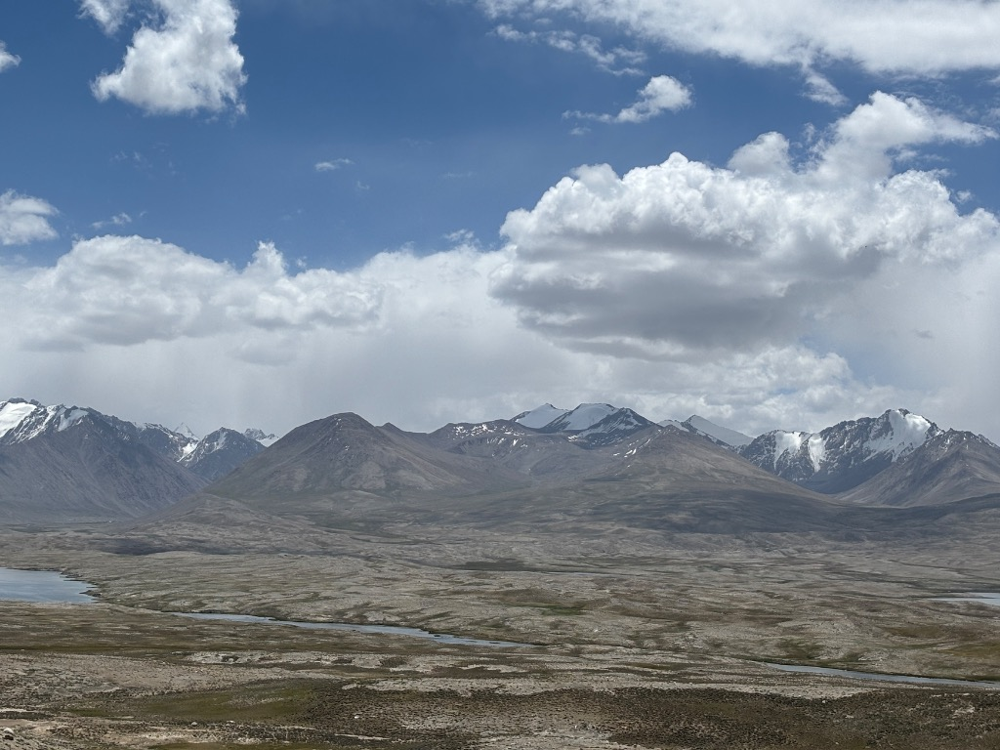

То самое место. Исток реки Памир, которая ниже по течению сольётся с рекой Вахан и даст начало великому Пянжу. А ещё через сотни километров, на стыке Таджикистана и Узбекистана, реку начнут называть Аму-дарья, да, та самая, которая питает хлопковые плантации Узбекистана и доносит свои капли до Аральского моря, пытаясь вернуть ему былой масштаб.