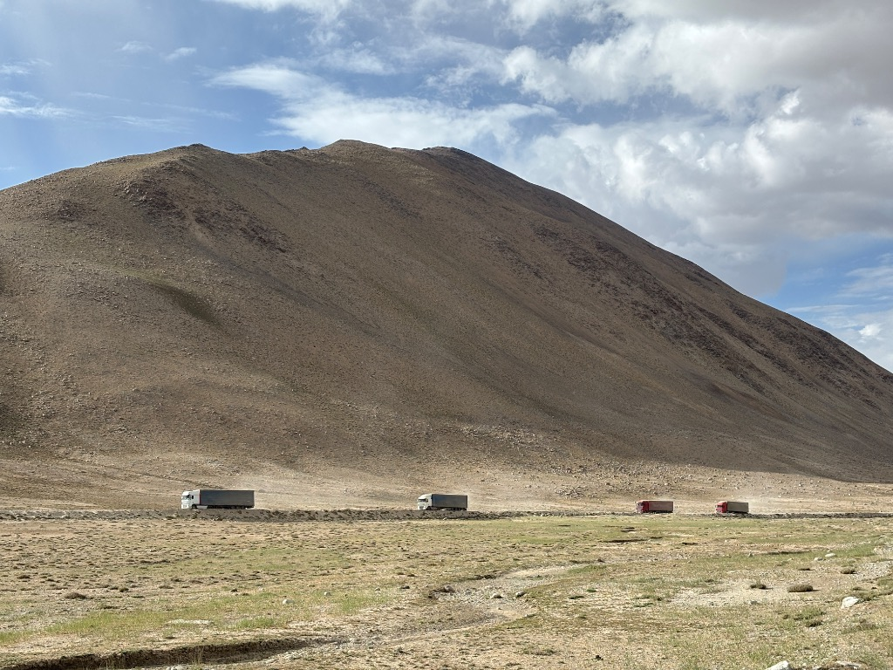

Спуск с Харгуша начался, как и ожидает любой нормальный человек - накатаная грунтовка. А потом пошёл полный трэш: песчанные участки, разбитая гравийка и мноооого стиральной доски. И всё это длится 20км. Доехали до М41 и ещё 20км с фурами. Но асфальта там не было 😂